# Surplus - The Dirty Story of One Cheat

## About the Project

**Surplus** is a "new" cheat for the game **survev.io**, which in reality is just a shameless fork of the cheat [**KrityHack**](https://github.com/Drino955/survev-krityhack). Its authors, **noam** and **mahdi**, stole the source code from [KrityHack](https://github.com/Drino955/survev-krityhack), slightly tweaked the UI, slapped on their own injection system, and started promote it under a new name, obfuscating everything to cover up their theft.

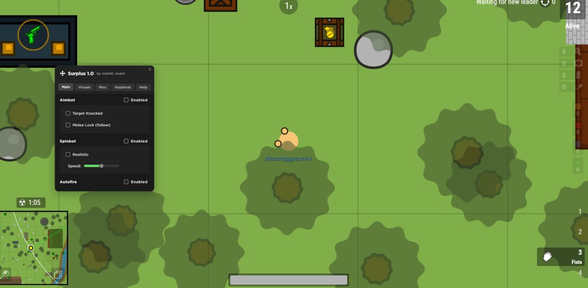

Their obfuscation? Just a lazy use of **js-confuser**, which caused insane lag. Even their users in chat constantly complained about the performance issues. After that, they were forced to lighten the obfuscation, but it didn’t save them—my friend **askile** easily deobfuscated the whole mess (even at the peak obfuscation level of js-confuser in version 1.2 of the cheat).

⚠️ **If you need help with obfuscation/deobfuscation, especially for game scripts, feel free to reach out to askile.**

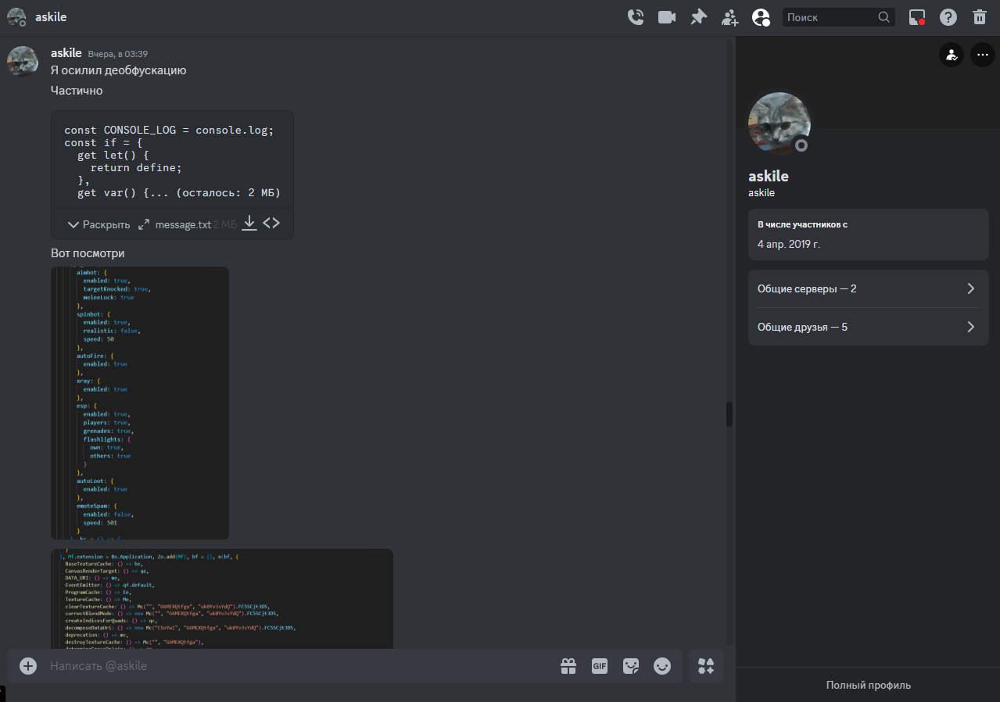

---

## The Theft Story

Surplus isn’t an original project—it’s a dirty fork of KrityHack with minimal changes:  
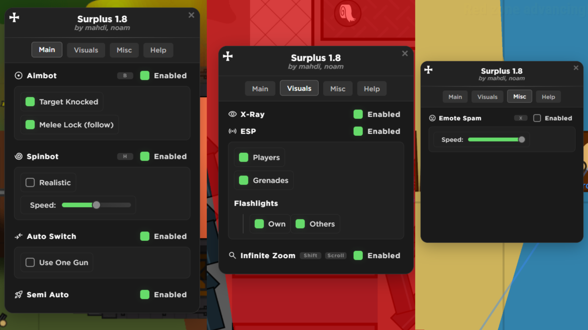

- The functionality is copied 1:1.
- The UI was written using ChatGPT.
- The injection system is just prototype hooks that noam didn’t even know how to make—someone else spoon-fed him the idea.
- The core code was blatantly copied from the public KrityHack repository.
- They obfuscated it all to hide the theft.
- When the code got deobfuscated, they denied everything until they were cornered with no way out.

---

## Who Are noam and mahdi?

### mahdi  
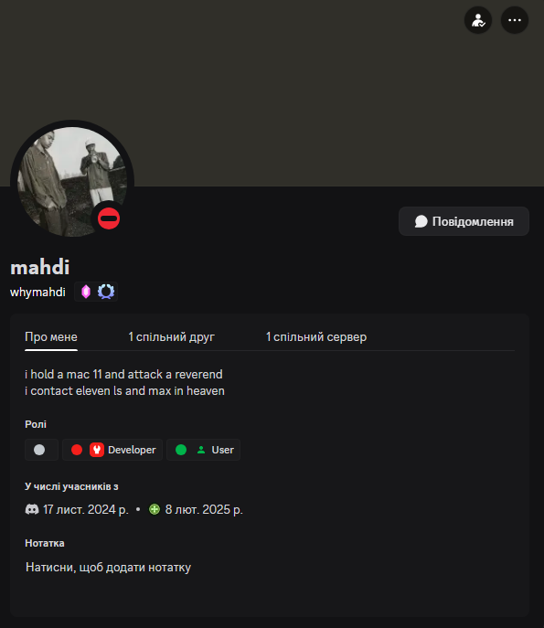  
- A 15-year-old kid from Poland.
- Can’t do anything complex himself—everything’s either ChatGPT or copy-paste.
- An open neo-Nazi and just an all-around disgusting person.
- Previously made scripts for Roblox, where he met noam.
- Scammed kids out of Robux, pocketing around $400, and still brags about it.
- Runs a scam Discord server for selling Robux: [discord.gg/RBXBuy](https://discord.gg/RBXBuy)—with 30k fake members (all bots).  
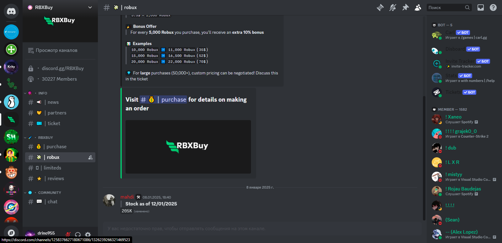  
- His scam website: [https://robuxstore.sellhub.cx/](https://robuxstore.sellhub.cx/)  
  
- YouTube:  
    - [whymahdi](https://www.youtube.com/@whymahdi/videos)  
    - [mahdii1337](https://www.youtube.com/@mahdii1337/videos)  
- GitHub:  
    - [mahdi13377](https://github.com/mahdi13377/)  
    - [mahdisbetter](https://github.com/mahdisbetter)  

### noam  
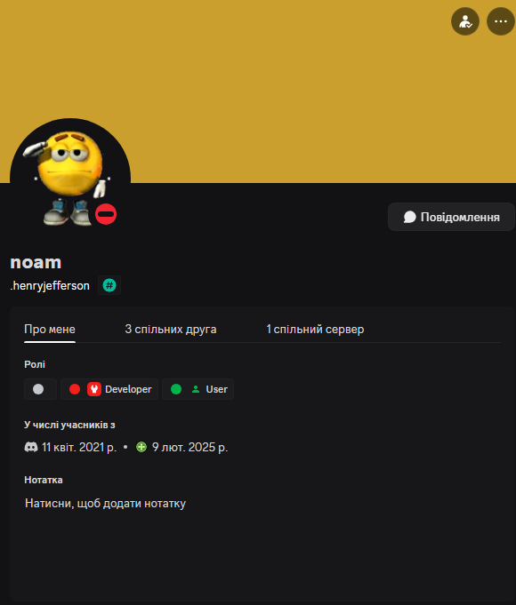  
- A 16-year-old kid from Israel.
- Made cheats for browser games like deeeep.io.
- Wrote primitive scripts for Scratch games.
- Didn’t come up with the injection system—someone else handed him the structure.
- GitHub:  
    - [nostopgmaming17](https://github.com/nostopgmaming17)  

---

## Evidence and Proof  

Mahdi’s scams:  
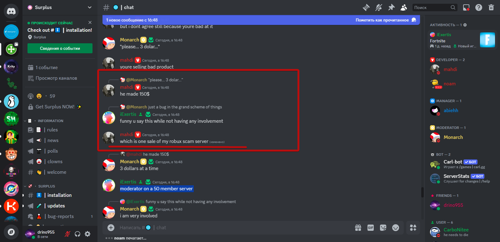  
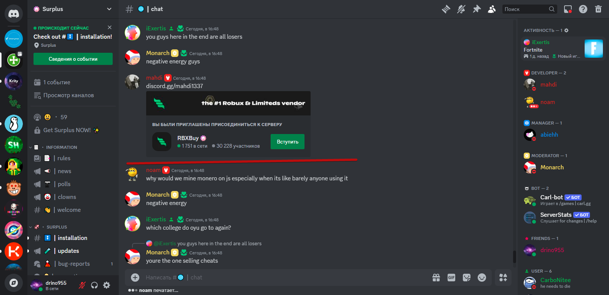  
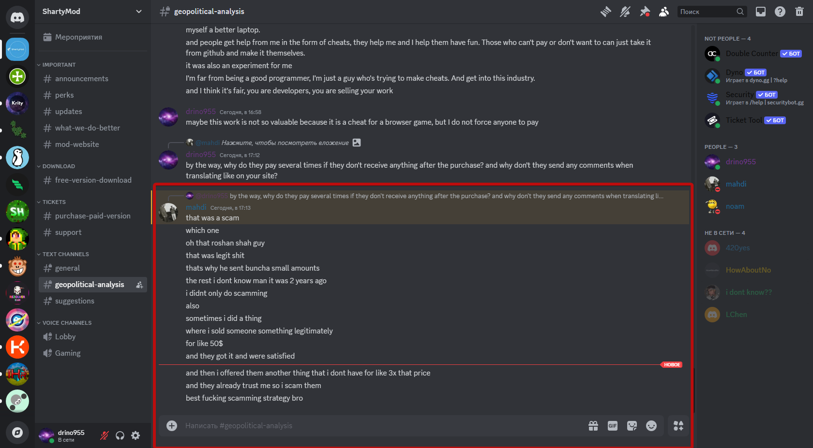  
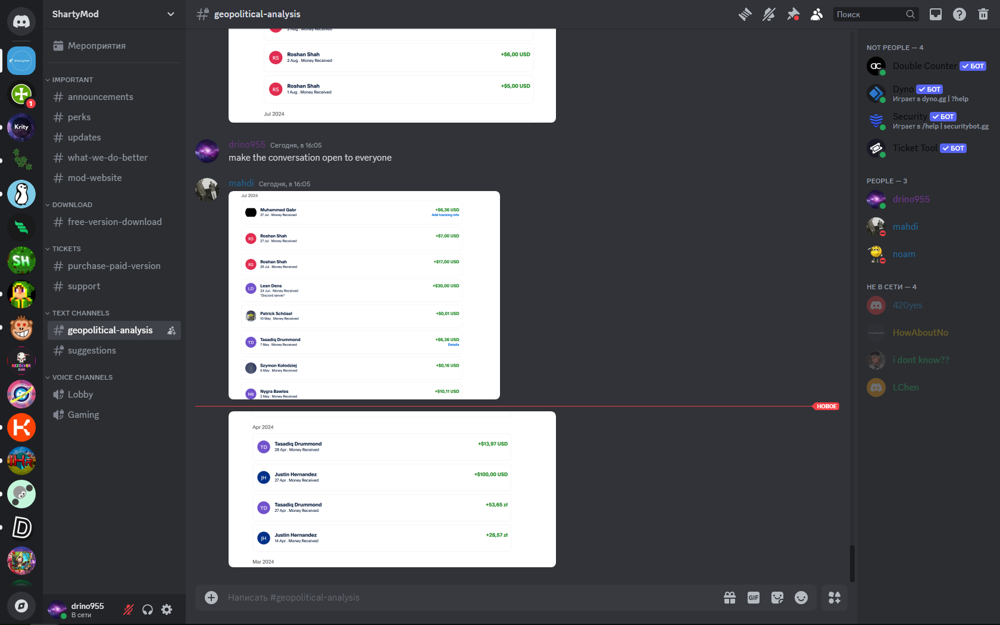  
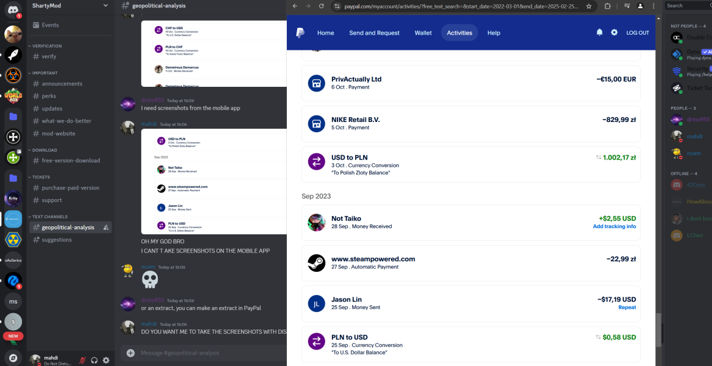  

---

## God-Level Hypocrisy  

These two stole my code and then had the audacity to call it "shitcode," even though they used it in their own product. Surplus is just a repackaged KrityHack, made by two script kiddies.  
They use other people’s source code, rely on open-source projects, and learn from them, but not only do they fail to credit the original developers—they outright deny it, shamelessly stealing code and passing it off as their own unique product. Since you didn’t want to release your source code, I’ll do it for you.

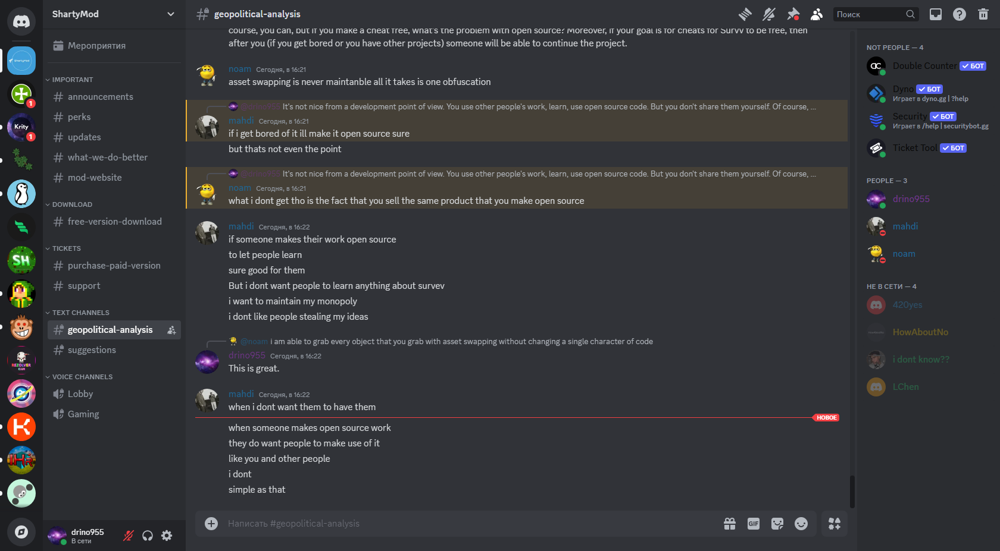  

---

## Important Info  

⚠️ **Never get involved with noam and mahdi.** They are:  
- Thieves.  
- Scammers.  
- Liars.  
- Hypocrites.  
- Just toxic people you can’t even have a normal conversation with.  

They’ve already screwed over dozens of people, and who knows what they’ll do next. Don’t trust them, don’t download their stuff—it could easily contain malware. These kids have zero reputation.  

---

## If You’ve Been Scammed or Have Info  

If you’ve been a victim of their actions or have more info about their scams or cheats, contact me:  

- 📲 Telegram: [t.me/drino955](https://t.me/drino955)  
- 🎮 Discord: **drino955**  

---

## Thanks  

Big shoutout to **askile** for deobfuscating Surplus. If you need anything related to obfuscation/deobfuscation, JavaScript code analysis, or hacking .io games, hit him up—he can help for a reasonable fee.  

---

## Ezz skids  
